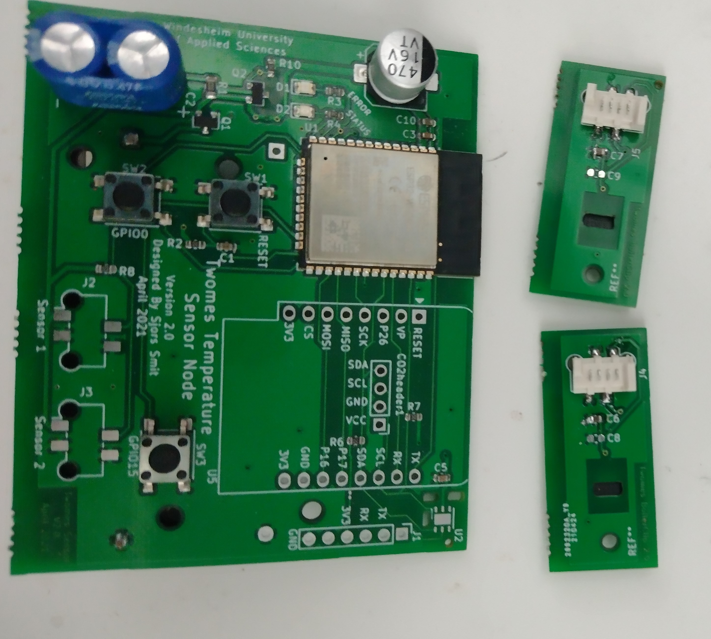
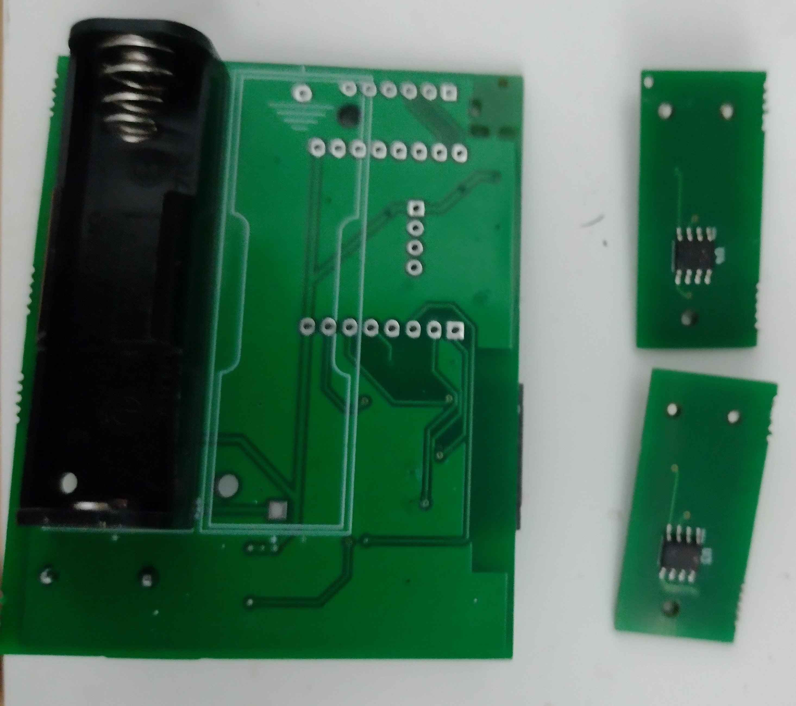

# Twomes Temperature Monitor Hardware

This repository contains the open hardware design files for the battery powered Twomes Temperature Monitor hardware, which can read measurement data from a varity of sensors:
* two [DS18b20(Z)](https://www.maximintegrated.com/en/products/sensors/DS18B20.html) temperature sensors in clamps that can be connected the supply water pipe (from the boiler to the hydronic radiators) and return water pipe (from the hydronic radiators to the boiler);
* an [Si7051](https://www.silabs.com/sensors/temperature/si705x/device.si7051) sensor mounted 
on the main PCB itself to measure room temperature;
* a [Twomes CO₂ meter shield](https://github.com/energietransitie/twomes-co2-meter-hardware) with the [WeMos D1 Mini shield](https://www.wemos.cc/en/latest/d1_mini_shield/index.html) form factor that measures temperature via an [Si7051](https://www.silabs.com/sensors/temperature/si705x/device.si7051) sensor and a Sensirion [SCD41](https://www.sensirion.com/en/environmental-sensors/carbon-dioxide-sensors/carbon-dioxide-sensor-scd4x/) sensor that measures CO₂ concentration, relative humidity and temperatue;
* a [SEK-SCD41](https://www.sensirion.com/en/environmental-sensors/evaluation-kit-sek-environmental-sensing/evaluation-kit-sek-scd41/) evaluation board that that measures CO₂ concentration, relative humidity and temperature;

The Twomes Temperature Monitor hardware can wirelessly send data to the [Twomes P1 Gateway measurement device](https://github.com/energietransitie/twomes-p1-gateway-firmware) using [ESP-NOW](https://www.espressif.com/en/products/software/esp-now/overview).

 

## Table of contents
* [General info](#general-info)
* [Producing](#producing)
* [Developing](#developing) 
* [Features](#features)
* [Status](#status)
* [License](#license)
* [Credits](#credits)

## General info
This repository contains the common hardware designs, such as schematics and board layout files for both the Twomes Room Monitor and Twomes Boiler Monitor hardware.

For the associated firmwware that you can run on this hardware, please see the following repositories:
* [twomes-twomes-room-monitor-firmware](https://github.com/energietransitie/twomes-room-monitor-firmware);
* [twomes-twomes-boiler-monitor-firmware](https://github.com/energietransitie/twomes-boiler-monitor-firmware);

## Producing
### Printed Circuit Board
To manufacture the printed circuit board you can use various PCB services. The folder [Output_files](./pcb/Output_files/FABRICATION) contains the necessary files. 

To have the PCBs manufactures via [JLCPCB](https://www.jlcpcb.com), the PCB manufacturer we used, upload the Gerber files in a zip to their [quote page](https://cart.jlcpcb.com/quote), select the amount of PCBs and a colour for silkscreen. All other options can be left on default. If SMT assembly is desired, also select this option before ordering. This will take you to a page where the BOM and POS file can be uploaded. 

There are two variants:
* for Twomes Boiler Monitor hardware, use the files [BOM_SENSOR_JLC.xlsx](./pcb/Output_files/FABRICATION/BOM_AND_POS/BOM_SENSOR_JLC.xlsx) and [TwomesSensor-top-pos.csv](./pcb/Output_files/FABRICATION/BOM_AND_POS/TwomesSensor-top-pos.csv);
* for Twomes Room Monitor hardware, use the files [BOM_SENSOR_JLC.xlsx](./pcb/Output_files/FABRICATION/BOM_AND_POS/BOM_SENSOR_JLC.xlsx) and [TwomesSensor.csv](./pcb/Output_files/FABRICATION/BOM_AND_POS/TwomesSensor.csv)

### Enclosure
There are two types of enclusure:
* for a Twomes Boiler Monitor enclosure and sensor clamps, use the files in the folder [enclosure/boiler-monitor](./enclosure/boiler-monitor); 
* for a Twomes Room Monitor enclosure, use the files in the folder [enclosure/toom-monitor](./enclosure/toom-monitor).

Both folders contain Fusion360 source files and exported STL files for the enclosures. The STL files can be imported into any slicer and turned into G-Code for a 3D printer. You can also upload  the STL files to an online 3D printing service of your choice.

## Developing
To change the hardware designs, you need:
* [KiCad](https://www.kicad.org/download/) installed to change the PCB design. 

Some EDA tools may be able to convert the files, however this is not supported and may result in errors.

To export the modified PCBs, consult the webpage of your PCB manufacturer of choice for guidance on how to produce the output files. For example,  see the [JLCPCB guide on how to export Gerbers](https://support.jlcpcb.com/article/149-how-to-generate-gerber-and-drill-files-in-kicad) and the  [JLCPCB guide how to export the BOM and POS files](https://support.jlcpcb.com/article/84-how-to-generate-the-bom-and-centroid-file-from-kicad)

## Features
The Twomes Temperature Mnitor device features the follwoing main hardware components:
* ESP32-WROOM-32D module;
* supercapacitor to assist the battery in high-current bursts.
* battery holder for a 3.6 V AA-size battery, such as the SAFT LS14500 Lithium Thionyl battery.
* FTDI compatible serial programming header (3,3 V).

## Status
Project is: _Ready for testing_

## License
The hardware designs in this repository are available under the [CERN-OHL-P v2 license](./LICENSE), Copyright 2021 [Research group Energy Transition, Windesheim University of Applied Sciences](https://windesheim.nl/energietransitie)

## Credits
This open hardware design is made by:
* Sjors Smit · [@Shorts1999](https://github.com/Shorts1999)

Thanks also go to:
* Fredrik-Otto Lautenbag ·  [@Fredrik1997](https://github.com/Fredrik1997)
* Gerwin Buma ·  [@GerwinBuma](https://github.com/GerwinBuma) 
* Marco Winkelman · [@MarcoW71](https://github.com/MarcoW71)

Product owner:
* Marco Winkelman · [@MarcoW71](https://github.com/MarcoW71)

We use and gratefully acknowlegde the efforts of the makers of the following designs:
* [KiCad Libraries](https://kicad.github.io/), by the KiCad Development Team, licensed under [adapted version of the CC-BY-SA 4.0 License](https://www.kicad.org/libraries/license/)
