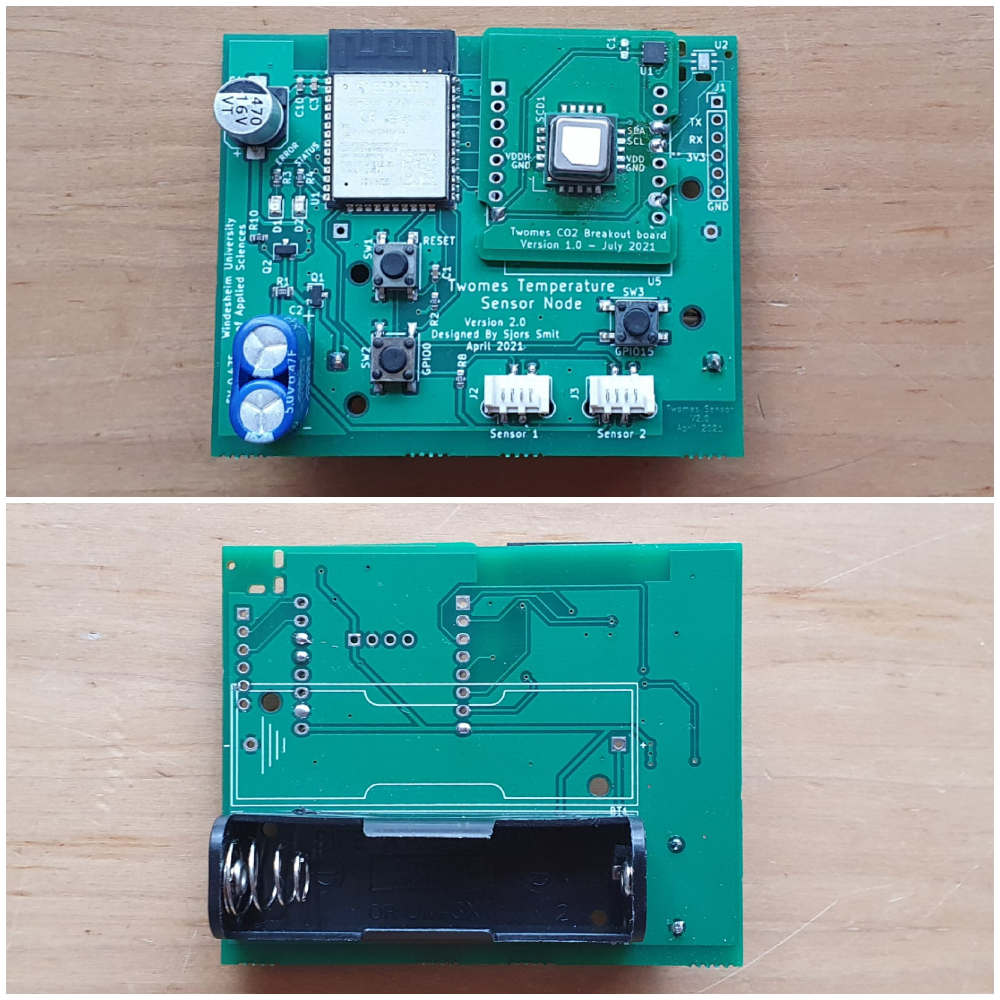
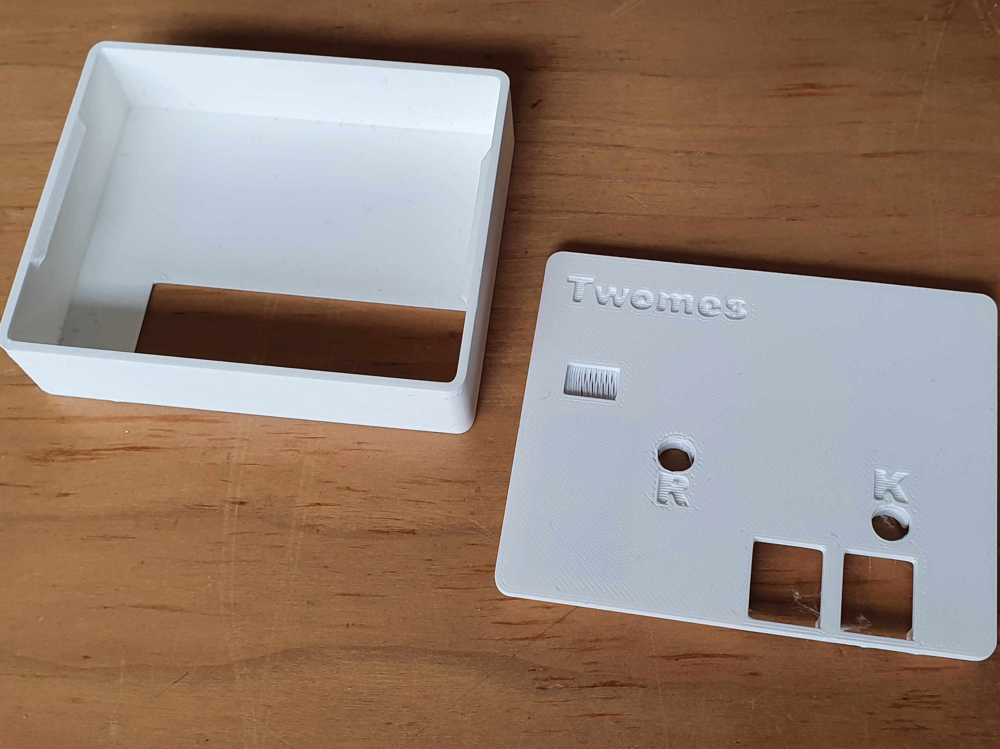

# Twomes Temperature Monitor Hardware

This repository contains the open hardware design files for the battery powered Twomes Temperature Monitor hardware, which can read measurement data from a varity of sensors:
* two [DS18b20(Z)](https://www.maximintegrated.com/en/products/sensors/DS18B20.html) temperature sensors in clamps that can be connected the supply water pipe (from the boiler to the hydronic radiators) and return water pipe (from the hydronic radiators to the boiler);
* an [Si7051](https://www.silabs.com/sensors/temperature/si705x/device.si7051) sensor mounted 
on the main PCB itself to measure room temperature;
* a [Twomes CO₂ Monitor Shield](https://github.com/energietransitie/twomes-co2-onitor-hardware) with the [WeMos D1 Mini shield](https://www.wemos.cc/en/latest/d1_mini_shield/index.html) form factor that measures temperature via an [Si7051](https://www.silabs.com/sensors/temperature/si705x/device.si7051) sensor and a Sensirion [SCD41](https://www.sensirion.com/en/environmental-sensors/carbon-dioxide-sensors/carbon-dioxide-sensor-scd4x/) sensor that measures CO₂ concentration, relative humidity and temperatue;
* a [SEK-SCD41](https://www.sensirion.com/en/environmental-sensors/evaluation-kit-sek-environmental-sensing/evaluation-kit-sek-scd41/) evaluation board that that measures CO₂ concentration, relative humidity and temperature.

The Twomes Temperature Monitor hardware can wirelessly send data to the [Twomes P1 Gateway measurement device](https://github.com/energietransitie/twomes-p1-gateway-firmware) using [ESP-NOW](https://www.espressif.com/en/products/software/esp-now/overview).

## Table of contents
* [General info](#general-info)
* [Producing](#producing)
* [Developing](#developing) 
* [Features](#features)
* [Status](#status)
* [License](#license)
* [Credits](#credits)

## General info
This repository contains the the source files and fabrication files of the hardware designs of theTwomes Room Monitor and Twomes Boiler Monitor pcb and its enclosure. It also includes a `docs` folder with recent printouts of the [schematics](./docs/twomes-temp-monitor-hardware-sch.pdf) and [PCB layout](./docs/twomes-temp-monitor-hardware-pcb.pdf). 

For the associated firmwware that you can run on this hardware, please see the following repositories:
* [twomes-twomes-room-monitor-firmware](https://github.com/energietransitie/twomes-room-monitor-firmware);
* [twomes-twomes-boiler-monitor-firmware](https://github.com/energietransitie/twomes-boiler-monitor-firmware);

## Producing
### Printed Circuit Board
To fabricate the printed circuit board you can use various PCB services. 

The folder [pcb/jlcpcb](./pcb/jlcpcb) includes all exported files needed to have the PCBs manufactured by [JLCPCB](https://www.jlcpcb.com). 
Upload the [zipped gerber files](./pcb\jlcpcb\gerber\gerber-TwomesSensor.zip) to the [JLCPCB quote page](https://cart.jlcpcb.com/quote), select the amount of PCBs and a colour for the silkscreen. All other options can be left on default. If SMT assembly is desired, also select this option before ordering. This will take you to a page where the BOM and POS file can be uploaded.  

Assembly of components depends on the variant you need:
* for assembly of a Twomes Boiler Monitor PCB, use the files [BOM-TwomesBoilerSensor.csv](./pcb/jlcpcb/assembly/boiler-monitor/BOM-TwomesBoilerSensor.csv) and [CPL-TwomesBoilerSensor.csv](./pcb/jlcpcb/assembly/boiler-monitor/CPL-TwomesBoilerSensor.csv);
* for assembly of a Twomes Room Monitor PCB, use the files [BOM-TwomesRoomSensor.csv](./pcb/jlcpcb/assembly/room-monitor/BOM-TwomesRoomSensor.csv) and [CPL-TwomesRoomSensor.csv](./pcb/jlcpcb/assembly/room-monitor/CPL-TwomesRoomSensor.csv)

N.B. All components marked "DO NOT PLACE" in the BOM-*.csv files can not be ordered from JLCPCB and need to be ordered from other services and placed manually.

### Enclosure
To fabricate the boiler monitor enclosure or the room room monitor enclosure you can use your own 3D printer or use a 3D printing service. 

Below you find a photo of the boiler enclosure. 

The folder [enclosure/fabrication](./enclosure/fabrication) contains exported STL files. You can print two types of enclusure:
* all enclusures share the same [case](./enclosure/fabrication/twomes-temp-monitor-enclosure-case.stl) and one [button](./enclosure/fabrication/twomes-temp-monitor-enclosure-button.stl)
* for a Twomes Boiler Monitor you need a [boiler monitor lid](./enclosure/fabrication/twomes-boiler-monitor-enclosure-lid.stl) and two [sensor clamps](./enclosure/fabrication/twomes-boiler-monitor-enclosure-clamp.stl); 
* for a Twomes Room Monitor you need a [room monitor lid](./enclosure/fabrication/twomes-room-monitor-enclosure-lid.stl).

The STL files can be imported into any slicer and turned into G-Code for a 3D printer. You can also upload the STL files to an online 3D printing service of your choice.

## Developing

### Printed Circuit Board
To change the hardware design of the PCB, you need:
* [KiCad](https://www.kicad.org/download/) installed to change te PCB design. 

The KiCad source files of the PCB can be found in the folder [pcb](./pcb).

To convert the PCBs into a format suitable for fabrication, consult the webpage of your PCB manufacturer of choice. For example, see the [JLCPCB guide on how to export Gerbers](https://support.jlcpcb.com/article/149-how-to-generate-gerber-and-drill-files-in-kicad) and the  [JLCPCB guide how to export the BOM and POS files](https://support.jlcpcb.com/article/84-how-to-generate-the-bom-and-centroid-file-from-kicad). You may also use a KiCad plug-in for this purpose such as [kicad-jlcpcb-tools](https://github.com/Bouni/kicad-jlcpcb-tools).

### Enclosure
To change the hardware design of the enclosure, you need either:
* [Autodesk Fusion 360](https://www.kicad.org/download/) installed (Autodesk provides 30 day free trials and [free one-year educational access](https://www.autodesk.com/education/edu-software/overview?sorting=featured&filters=individual) to its products and services for eligible students, teachers and research staff); 
* or [FreeCAD](https://www.freecadweb.org/), an open source alternative.

The source files of the enclosure can be found in the folder [enclosure](./enclosure). We include both .f3d source files and .step source files we obtained after conversion.
## Features
The Twomes Temperature Monitor device features the follwoing main hardware components:
* ESP32-WROOM-32D module;
* supercapacitor to assist the battery in high-current bursts.
* battery holder for a 3.6 V AA-size battery, such as the SAFT LS14500 Lithium Thionyl battery.
* FTDI compatible serial programming header (3.3 V).

To-do:
* remove `SW2` (not used in newer firmware)
* remove holes above SW2 and SW3 in enclosure lids (SW3 not used in newer firmware; SW2 does not need to be user accessible, only used during deployment))  
* remove letters 'R' and 'K' from enclusure lids (only a single end-user accessible button used in newer firmware )
## Status
Project is: _in progress_

## License
The hardware designs in this repository are available under the [CERN-OHL-P v2 license](./LICENSE), Copyright 2022 [Research group Energy Transition, Windesheim University of Applied Sciences](https://windesheim.nl/energietransitie)

## Credits
This open hardware design is made by:
* Sjors Smit · [@Shorts1999](https://github.com/Shorts1999)

Thanks also go to:
* Fredrik-Otto Lautenbag ·  [@Fredrik1997](https://github.com/Fredrik1997)
* Gerwin Buma ·  [@GerwinBuma](https://github.com/GerwinBuma) 
* Marco Winkelman · [@MarcoW71](https://github.com/MarcoW71)

Product owner:
* Marco Winkelman · [@MarcoW71](https://github.com/MarcoW71)

We use and gratefully acknowlegde the efforts of the makers of the following designs:
* [KiCad Libraries](https://kicad.github.io/), by the KiCad Development Team, licensed under [an adapted version of the CC-BY-SA 4.0 License](https://www.kicad.org/libraries/license/)
